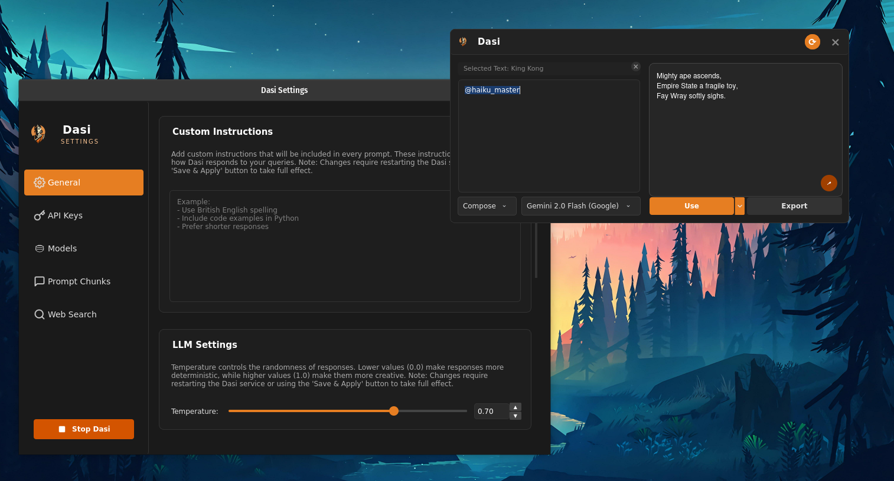

#  Dasi

<div align="center">
Dasi is a desktop assistant that provides seamless LLM integration directly into your workflow. With a non-intrusive interface and support for multiple AI providers, Dasi enhances productivity by making AI assistance available anywhere on your desktop through a customizable global hotkey.

[](https://www.python.org/downloads/)
[](LICENSE)
[](https://www.riverbankcomputing.com/software/pyqt/)
[](https://astral.sh/uv)

[Features](#features) • [Installation](#installation) • [Configuration](#configuration) • [Getting Started](#getting-started) • [Contributing](#contributing)


</div>

## Features

### Core Functionality
- **Global Hotkey Integration**: Instant activation with Ctrl+Alt+Shift+I (customizable)
- **Context-Aware Interface**: Modern, borderless UI that appears near your cursor
- **Intelligent Context Handling**: Utilizes selected text for enhanced responses
- **Dual Operation Modes**:
  - **Chat Mode**: Interactive conversations and explanations
  - **Compose Mode**: Direct content generation and insertion

### AI Provider Integration
- **Multiple Model Providers**:
  - Google Gemini
  - OpenAI
  - Anthropic
  - Groq
  - Ollama (local models)
  - Deepseek
  - Together AI
  - OpenRouter
  - Custom OpenAI-compatible endpoints

### Advanced Features
- **Tool Calling**: Extend AI capabilities with system tools
- **Prompt Chunks**: Template system with @mention support
- **Flexible Output Options**: Choose between copy/paste or simulated typing
- **Web Search Integration**: Access up-to-date information from the web
- **Comprehensive Settings**: Granular control over API configuration, model selection, and custom instructions

## Installation

### Platform Support
- **Operating System**: Linux (X11 display server only)
- **Wayland Support**: Currently not supported. Dasi relies on X11 for certain functionalities like global hotkeys and cursor position detection.

### Prerequisites
- Python 3.10 or higher
- uv package manager (follow [installation guide](https://astral.sh/uv))
- For Windows users: `pywin32` and `winshell` packages (optional, for shortcut creation)

### Quick Installation

1. Clone the repository:
   ```bash
   git clone https://github.com/Mithun-750/Dasi.git
   cd Dasi
   ```

2. Run the installation script:
   ```bash
   python scripts/installer.py install
   ```

### Development Setup

If you want to run Dasi locally for development:

1. Clone the repository:
   ```bash
   git clone https://github.com/Mithun-750/Dasi.git
   cd Dasi
   ```

2. Install dependencies and set up the project:
   ```bash
   # Install dependencies in development mode
   uv pip install -e .
   ```

3. Use the provided Invoke tasks to manage your workflow:
   ```bash
   # Run the application in development mode
   inv dev
   
   # Install project dependencies
   inv install
   
   # Sync project dependencies
   inv sync
   
   # Build the application
   inv build
   
   # Load default configuration files
   inv load_defaults
   
   # Build Dasi as an AppImage (Linux)
   inv appimage
   ```

### Uninstallation

To uninstall Dasi, run:
```bash
python scripts/installer.py uninstall
```

## Configuration

### API Setup
1. Launch Dasi and access Settings via system tray
2. Navigate to "API Keys" tab
3. Add your API keys for desired providers
4. Select and configure models in "Models" tab

### Customization
- **Custom Instructions**: Add global context for all queries
- **Temperature**: Adjust response creativity
- **Startup**: Configure autostart and initial behavior
- **Hotkeys**: Customize activation shortcuts

## Getting Started

For detailed usage instructions, please refer to the [Getting Started Guide](Getting%20Started%20Guide.md) file.

## Contributing

Contributions are welcome. Please follow these steps:

1. Fork the repository
2. Create a feature branch
3. Install project dependencies:
   ```bash
   uv pip install -e .
   ```
4. Make your changes
5. Submit a pull request

## License

This project is licensed under the MIT License - see the [LICENSE](LICENSE) file for details.

## Acknowledgments

- [LangChain](https://python.langchain.com/) for the AI integration framework
- [PyQt6](https://www.riverbankcomputing.com/software/pyqt/) for the GUI framework
- [Cursor IDE](https://cursor.sh/) for the development environment that helped build this project
- [Fabric](https://github.com/danielmiessler/fabric) for prompt engineering inspiration
- All the AI model providers for their APIs

