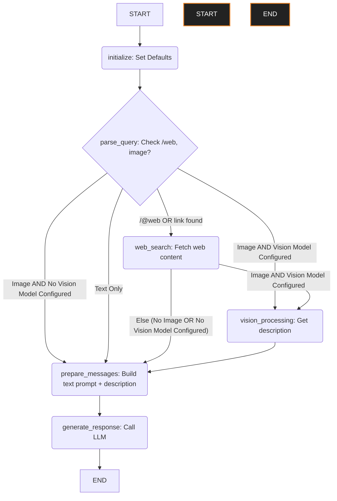

# Dasi LangGraph Flow

This diagram illustrates the flow of execution within the `LangGraphHandler`.

## Node Descriptions

*   **initialize**: Sets default values for the graph state.
*   **parse_query**: Analyzes the user query to detect web search triggers (`/web` or URLs) and the presence of image data. Determines `use_web_search` and `use_vision` flags.
*   **web_search**: If triggered, performs a web search using `WebSearchHandler` or scrapes content from a link. Updates state with results.
*   **vision_processing**: If an image is present *and* a dedicated vision model is configured in settings, calls `VisionHandler` to get a text description of the image. Updates state with the description.
*   **prepare_messages**: Constructs the final list of messages for the LLM based on the current state:
    *   Includes system prompt, mode instruction (chat/compose), and chat history.
    *   Incorporates web search results (or errors) if available.
    *   If a `vision_description` exists (from `vision_processing`), appends it to the text query.
    *   If `image_data` exists *and* no vision model was configured, constructs a multimodal message (text + image).
    *   If `image_data` existed but `vision_processing` failed (and a vision model *was* configured), adds a system note about the failure.
*   **generate_response**: Invokes the selected LLM instance with the prepared messages. Extracts code blocks if in Compose Mode. Adds query and response to history. 